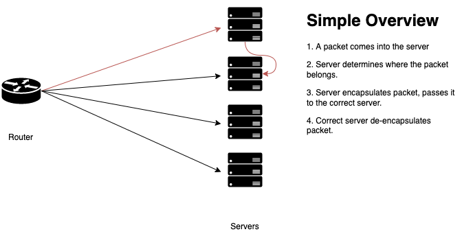

# -

This is a fun project to help me better understand load balancers/proxies.
The intention is to create an edge load balancer similar to Cloudflare's Unimog.



## Constraints
- Management through gRPC
- Assumes either jumbo frames are enabled or lower MTU is advertised
- Forwarding table changes should not break connections

## Setup

Example config:
```
ip_addr = "127.0.0.1"

ports = [
    8080,
    8081,
    8082,
]

debug = false

[[apps]]
uuid = "test-app"
# This will be used as the anycast address
ip_addr = "127.0.1.0"

[[apps.targets]]
ip_addr = "127.0.1.1"
weight = 100

[[apps.targets]]
ip_addr = "127.0.1.2"
weight = 85

[[apps.targets]]
ip_addr = "127.0.1.3"
weight = 75

[[apps]]
uuid = "test-app2"
# This will be used as the anycast address
ip_addr = "127.0.2.0"

[[apps.targets]]
ip_addr = "127.0.2.1"
weight = 100

[[apps.targets]]
ip_addr = "127.0.2.2"
weight = 85

[[apps.targets]]
ip_addr = "127.0.2.3"
weight = 75
```
